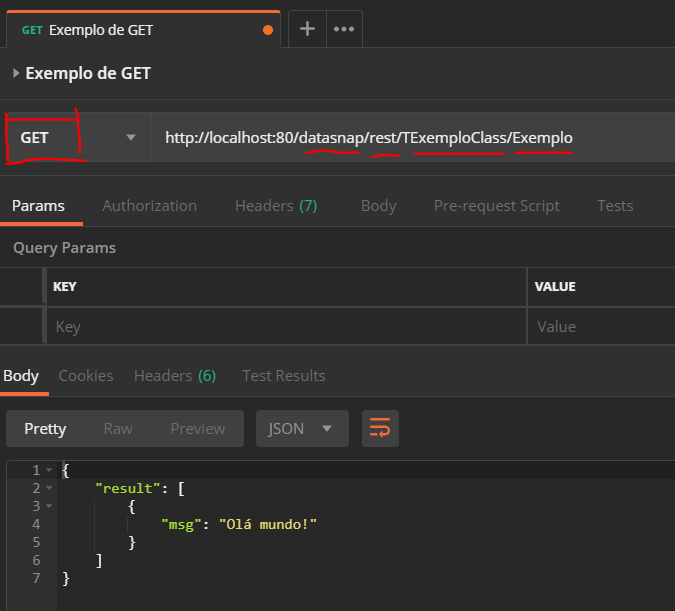

# exemplo_datasnap_simples
Exemplo simples de um servidor DataSnap Stand Alone


**Leitura complementar:** http://docwiki.embarcadero.com/RADStudio/Rio/en/DataSnap_REST_Messaging_Protocol


Este projeto exemplifica um servidor DataSnap simples estilo RESTful.

Foi desenvolvido no formato _stand alone_ para simplificar o entendimento.


É composto por três módulos:

- `Main.pas` - Interface GUI
- `Rules.pas` - Data Module com os componentes de servidão DataSnap
- `ServerMethodsExample` - Classe remota de exemplo  

---

## Montagem do servidor DataSnap RESTful


Da paleta `Datasnap Server` utilizamos os seguintes componentes:


- `TDSServer`: 
- `TDSHTTPService`:
- `TDSAuthenticationManager`:
- `TDSServerClass`:

---

## Sobre a autenticação do usuário

A autenticação do usuário se dará pelo _Basic Scheme_.

Quem resolve esta questão no Datasnap é o componente `TDSAuthenticationManager` através do método `UserAuthenticate`.

Um exemplo didático:

```pascal
procedure TdmRules.DSAuthenticationManager1UserAuthenticate(Sender: TObject;
  const Protocol, Context, User, Password: string; var valid: Boolean;
  UserRoles: TStrings);
begin
   valid := (User = 'admin') and (Password = 'admin');
end;
```


No cabeçalho HTTP esta informação trafega da seguinte maneira:

`Authorization: Basic YWRtaW46YWRtaW4=`

Onde:

- `Authorization`:  Nome do cabeçalho onde trafega as credenciais do usuário
- `Basic`: Nome do esquema de autorização sendo que `Basic` é uma das formas mais simples.
- `YWRtaW46YWRtaW4=`: Usuário e senha codificado em `Base64`. Neste exemplo é equivalente ao texto `admin:admin`.


Cada vez que o servidor Datasnap recebe uma solicitação HTTP ele irá validar o usuário e estando OK o método remoto é executado.

No cabeçalho da resposta virá o seguinte cabeçalho:

`Pragma: 93810.504722.139823,dssessionexpires=1199984`

Onde:

- `Pragma`: Nome do cabeçalho

- `93810.504722.139823`:  ID da sessão dentro do servidor DataSnap

- `dssessionexpires=1199984`: Tempo restante para a expiração da sessão em milissegundos.

  

Portanto as próximas chamadas de uma mesma sessão não precisam mais enviar o cabeçalho `Authorization` passando a enviar o cabeçalho `Pragma`, como no exemplo a seguir:

`Pragma: dssession=93810.504722.139823`

Isso alivia o servidor no tocante à uma eventual constante validação de usuário.

---

## Consumindo o servidor pelo Postman


### Verbo GET





### Verbo POST


